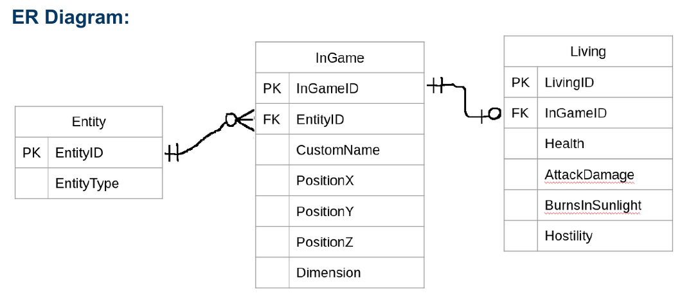
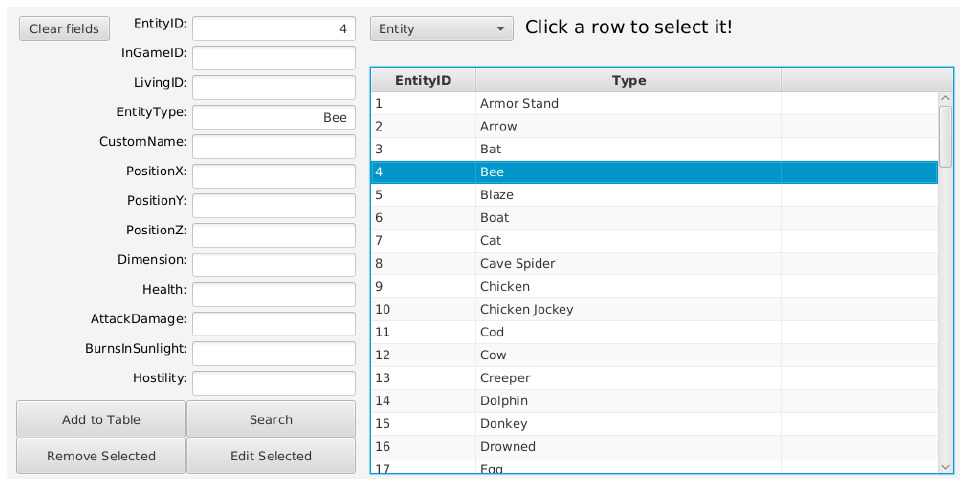
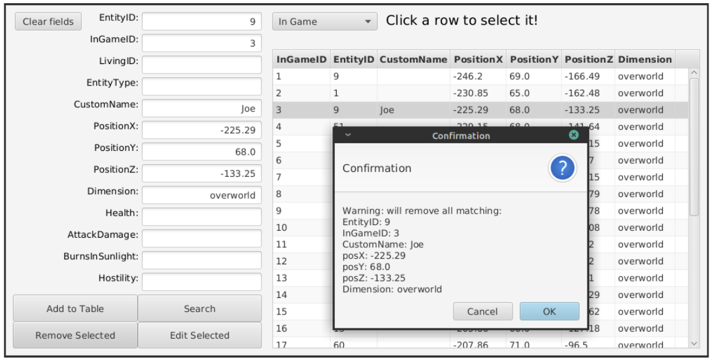

# Minecraft Entity Database
## Database w/ GUI using JavaFX and SQLite3
* (Project from my Database class) - The goal is to keep track of entities and their attributes in any Minecraft world.
* Add, edit, delete, and search based on attributes.
* Click the releases tab to download. (Requires java 8+)

